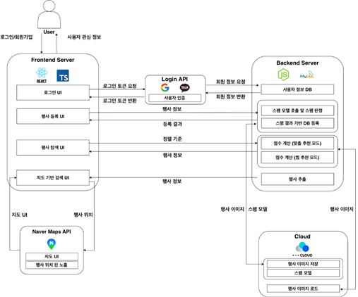
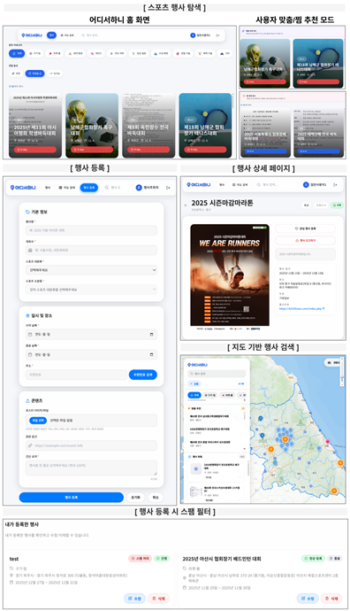

# 🏆 어디서하니 (Sport Contest Finder)

[공모전명] (2025.8.01 ~ing)

> **아이디어명**: 어디서하니 ('스포츠 행사 정보, 어디서 찾지? 한눈에 확인하니!')

> **아이디어 개요**: 지역별로 분산되어 있는 스포츠 대회·행사 정보를 인터랙티브 지도 기반 플랫폼으로 통합하여, 사용자가 원하는 지역과 종목의 행사를 한눈에 탐색하고 AI 추천을 통해 개인화된 행사 정보를 제공하는 웹 서비스

---

## 🎈 Makers

| 이름 | 역할 |
|------|------|
| **[안유리]** (팀장) | PM |
| **[이규현]** | 프론트엔드 개발, 백엔드 개발, API 개발, 서버 개발 |
| **[임형근]** | 프론트엔드 개발, 데이터베이스 개발, 지도 시각화 구현 |
| **[하승연]** | ML 모델 개발, 추천 알고리즘 구현, 스팸 필터링 |

---

## 💡 아이디어 발상 동기

### 문제 제기

1. **정보의 분산**: 스포츠 대회 정보가 각 지자체, 협회, 개인 홈페이지 등에 분산되어 있어 통합 탐색이 어려움
2. **지역 기반 탐색의 한계**: 텍스트 기반 검색만으로는 지역별 행사 정보를 직관적으로 파악하기 어려움
3. **개인화 부재**: 모든 사용자에게 동일한 정보를 제공하여 사용자 취향과 관심사를 반영하지 못함
4. **정보 비대칭**: 수도권과 비수도권 간 스포츠 행사 정보 접근성 격차 존재
5. **검색 비효율**: 키워드 검색만으로는 원하는 종목과 지역을 조합한 행사를 찾기 어려움

### 인공지능(AI) 기술을 통한 개발 동기

1. **개인화 추천의 필요성**: 사용자의 찜 목록과 관심 종목을 분석하여 유사한 사용자 기반 협업 필터링으로 맞춤형 행사 추천 제공
2. **자동 스팸 필터링**: 대량의 행사 등록 데이터를 자동으로 검수하여 부정 행사 차단 및 품질 관리
3. **데이터 기반 인사이트**: 사용자 행동 데이터를 분석하여 인기 행사, 지역별 트렌드 등을 도출

---

## 💡 아이디어 내용

### 서비스 이용자

- 다양한 지역의 스포츠 행사 정보가 필요한 모든 스포츠 애호가
- 특정 종목의 대회를 찾고 있는 선수 및 코치
- 지역별 행사를 기획하고 홍보하려는 행사 주최자
- 가족과 함께 참여할 수 있는 생활 체육 행사를 찾는 일반인

### 핵심 내용

1. **인터랙티브 지도 기반 탐색**
   - TopoJSON을 활용한 한국 전국 지도 시각화
   - 지역 클릭만으로 해당 지역 행사 자동 필터링
   - 행사 위치를 지도 위 핀으로 직관적 표시

2. **AI 기반 개인화 추천**
   - 코사인 유사도 알고리즘으로 유사 사용자 찾기
   - 유사 사용자들이 찜한 종목 기반 행사 추천
   - 관심 종목 설정에 따른 맞춤형 큐레이션

3. **다양한 필터링 시스템**
   - 지역: 광역자치단체 및 시·군·구 단위 필터
   - 종목: 대분류/소분류 스포츠 카테고리 필터
   - 키워드: 제목, 설명, 지역명 통합 검색
   - 정렬: 최신순, 인기순(조회수), 날짜순, 이름순

4. **행사 관리 기능**
   - 행사 등록/수정/삭제 (인증된 사용자)
   - 실시간 조회수 증가 및 동기화
   - 찜하기 기능으로 관심 행사 저장
   - 행사 상세 정보 조회 (일시, 장소, 주최, 웹사이트 등)

5. **자동 스팸 필터링**
   - BERT 모델 기반 텍스트 분류
   - 행사 제목 및 설명 자동 검수
   - 스팸으로 판단된 행사는 승인 보류 처리

### 타 서비스와의 차별점

1. **지도 기반 직관적 탐색**: 텍스트 검색이 아닌 시각적 지도에서 지역별 행사 탐색 가능
2. **AI 추천 시스템**: 단순 정렬이 아닌 사용자 행동 데이터 기반 개인화 추천 제공
3. **통합 정보 제공**: 분산된 행사 정보를 하나의 플랫폼에서 통합 제공
4. **실시간 정보 동기화**: 조회수, 행사 상태 등을 실시간으로 업데이트
5. **전문적 필터링**: 대분류/소분류 종목 체계적 분류로 정확한 검색 가능

---

## 💡 구현 계획

### 1. 데이터 수집 및 구조화

#### 🔑 스포츠 종목 카테고리 시스템 구축
- 교육부 및 스포츠 협회 데이터를 기반으로 대분류/소분류 체계 확립
- 10개 대분류 (구기·팀, 라켓·볼, 무도·격투, 피트니스·기능, 정밀, 얼음·눈, 수상, 레저, 정신, 기타)
- 각 대분류별 세부 소분류 종목 매핑

#### 📊 행사 데이터 수집
- 사용자 직접 등록 방식으로 데이터 확보
- 행사 주최자, 행사명, 설명, 일시, 장소, 종목, 지역 등 구조화된 데이터 수집
- 이미지 업로드를 통한 시각적 정보 제공

### 2. 데이터 전처리 및 품질 관리

#### 📦 스팸 필터링 (ML)
- **모델**: BERT (klue/bert-base) 기반 텍스트 분류 모델
- **전처리**: 
  - 행사 제목과 설명을 입력으로 받아 스팸 점수 계산
  - Python 프로세스로 모델 실행하여 Node.js와 통합
  - 임계값 기준으로 승인/보류 결정

#### ✂ 데이터 검증
- 필수 필드 검증 (제목, 설명, 일시, 장소 등)
- 날짜 유효성 검사 (시작일 < 종료일)
- 이미지 파일 형식 및 크기 제한
- 중복 행사 자동 감지

### 3. 모델링 구축

#### 🤖 추천 시스템 (협업 필터링)

**코사인 유사도 알고리즘**
- 사용자-종목 행렬 생성 (사용자가 특정 종목을 찜했는지 여부를 0/1로 표현)
- 코사인 유사도 공식: `cos(θ) = (A·B) / (||A|| ||B||)`
- 유사도가 높은 상위 5명의 사용자 선택
- 해당 사용자들이 찜한 종목 중 본인이 찜하지 않은 종목 추천

```
1. 사용자 A의 찜 목록: [축구, 농구, 야구]
2. 사용자 B의 찜 목록: [축구, 농구, 배구]
3. 코사인 유사도 계산: cos(θ) = (1·1 + 1·1 + 0·0) / (√3 · √3) = 0.667
4. 유사도 높은 사용자들의 찜 목록 분석
5. 사용자 A에게 '배구' 종목 행사 추천
```

#### 🧱 기술 스택

**프론트엔드**
- React 18 + TypeScript
- Vite (빌드 도구)
- React Router v7 (라우팅)
- Tailwind CSS (스타일링)
- react-simple-maps + d3-geo (지도 시각화)

**백엔드**
- Node.js + Express
- MySQL (데이터베이스)
- JWT (인증)
- Passport.js (OAuth)

**ML/AI**
- Python + BERT 모델 (스팸 필터링)
- JavaScript 코사인 유사도 구현 (추천 시스템)

### 4. 프로토타입 구현

#### 시스템 아키텍처


---
#### 주요 구현 기능

**지도 시각화**
- TopoJSON 데이터 파싱 및 SVG 렌더링
- 지역 클릭 이벤트 처리
- 행사 위치 좌표 매핑 및 핀 표시
- 줌, 팬 등 지도 조작 기능

**추천 시스템**
- 실시간 사용자 행동 데이터 수집
- 사용자-종목 행렬 동적 생성
- 코사인 유사도 계산 및 상위 유사 사용자 추출
- 추천 종목 기반 행사 필터링

**성능 최적화**
- 라우트 기반 코드 분할 (React.lazy)
- 컴포넌트 메모이제이션 (React.memo)
- 이미지 지연 로딩
- API 응답 캐싱

---

## 💡 기대효과

### 📃 서비스 전후의 차이점

| 구분 | 서비스 전 | 서비스 후 |
|------|----------|----------|
| **정보 탐색 시간** | 각 사이트별로 30분~1시간 소요 | 지도 클릭으로 즉시 탐색 (1분 이내) |
| **정보 접근성** | 수도권 중심 정보 제공 | 전국 모든 지역 정보 통합 제공 |
| **개인화 수준** | 모든 사용자에게 동일 정보 | 사용자 취향 기반 맞춤 추천 |
| **정보 정확도** | 수동 검수로 인한 오류 가능성 | AI 기반 자동 필터링으로 품질 향상 |
| **행사 등록** | 각 플랫폼별 개별 등록 필요 | 통합 플랫폼에서 한 번에 등록 |

### 📃 확장성

1. **커뮤니티 기능 추가**
   - 행사 후기 작성 및 공유
   - 참가자 모집 게시판
   - 지역별 스포츠 커뮤니티 형성

2. **모바일 앱 개발**
   - React Native로 iOS/Android 앱 개발
   - 위치 기반 근처 행사 알림
   - 푸시 알림으로 관심 행사 정보 제공

3. **데이터 분석 및 트렌드 제공**
   - 지역별 인기 종목 통계
   - 계절별 행사 트렌드 분석
   - 행사 주최자를 위한 인사이트 리포트

4. **결제 시스템 연동**
   - 행사 참가비 온라인 결제
   - 티켓 발급 시스템
   - 환불 처리 자동화

---

## 🛠 기술 스택

### Frontend
- **React 18.2.0** - UI 라이브러리
- **TypeScript 5.9.3** - 타입 안정성
- **Vite 7.1.7** - 빠른 개발 서버 및 번들러
- **React Router 7.9.5** - 클라이언트 사이드 라우팅
- **Tailwind CSS 3.4.18** - 유틸리티 기반 스타일링
- **react-simple-maps** - 지도 렌더링
- **d3-geo** - 지리 데이터 처리

### Backend
- **Node.js 20.x** - 런타임 환경
- **Express 5.1.0** - RESTful API 서버
- **MySQL 8.0+** - 관계형 데이터베이스
- **JWT** - 인증 토큰 관리
- **Passport.js** - OAuth 인증

### ML/AI
- **Python 3.8+** - ML 스크립트 실행
- **BERT (klue/bert-base)** - 스팸 텍스트 분류
- **Transformers** - Hugging Face 라이브러리

### 인프라
- **NHN Cloud** - 클라우드 서버 호스팅
- **Nginx** - 리버스 프록시
- **PM2** - 프로세스 관리

---

## 📊 주요 기능 상세

### 1. 인터랙티브 지도 탐색
- TopoJSON 기반 한국 전국 지도 렌더링
- 지역 클릭 시 해당 지역 행사만 필터링
- 행사 위치를 지도 위 핀으로 시각화
- 카카오맵 API 연동으로 상세 위치 정보 제공

### 2. AI 추천 시스템
- 코사인 유사도 알고리즘 기반 협업 필터링
- 사용자 찜 목록 분석으로 유사 사용자 발견
- 추천 종목 기반 행사 자동 큐레이션
- 관심 종목 설정에 따른 맞춤형 추천

### 3. 고급 검색 필터
- 지역: 17개 광역자치단체 + 시·군·구 단위
- 종목: 10개 대분류 + 세부 소분류
- 키워드: 제목, 설명, 지역명 통합 검색
- 정렬: 최신순, 인기순, 날짜순, 이름순, 추천순

### 4. 사용자 인증 시스템
- JWT 기반 토큰 인증
- 카카오, 구글 OAuth 소셜 로그인
- 세션 관리 및 자동 로그아웃
- 회원가입/로그인/로그아웃

### 5. 행사 관리
- 행사 등록/수정/삭제 (인증 사용자)
- 이미지 업로드 (오브젝트 스토리지)
- 실시간 조회수 증가
- 찜하기 기능
- 행사 상태 관리 (진행/종료)

### 6. 스팸 자동 필터링
- BERT 모델 기반 텍스트 분류
- 행사 제목 및 설명 자동 검수
- 스팸 점수 계산 및 임계값 기준 승인/보류
- 관리자 수동 승인 대기 시스템

---

## 🚀 실행 방법

### 필수 요구사항
- Node.js v18.0.0 이상 (권장: v20.x LTS)
- MySQL 8.0 이상
- Python 3.8 이상 (스팸 필터링용)

## 📸 프로젝트 화면

<!-- 이미지 삽입 예시 -->
<!-- 방법 1: 상대 경로 (로컬 및 GitHub 모두 지원) -->



- **홈 화면**: 인기 행사 TOP, 추천 행사 목록
- **지도 검색**: 인터랙티브 지도에서 지역별 행사 탐색
- **행사 상세**: 행사 정보, 찜하기, 조회수
- **마이페이지**: 찜 목록, 내가 등록한 행사 관리

---

## 💡 개발 후기

---

## 👥 팀원

- **[안유리]** - GitHub: [@ahnyuu]
- **[이규현]** - GitHub: [@2gyuhxx]
- **[임형근]** - GitHub: [@hxxungg]
- **[하승연]** - GitHub: [@ha020206]
---

<div align="center">

**Made with ❤️ by [Shift + Delete]**

⭐ Star this repo if you find it helpful!

</div>
